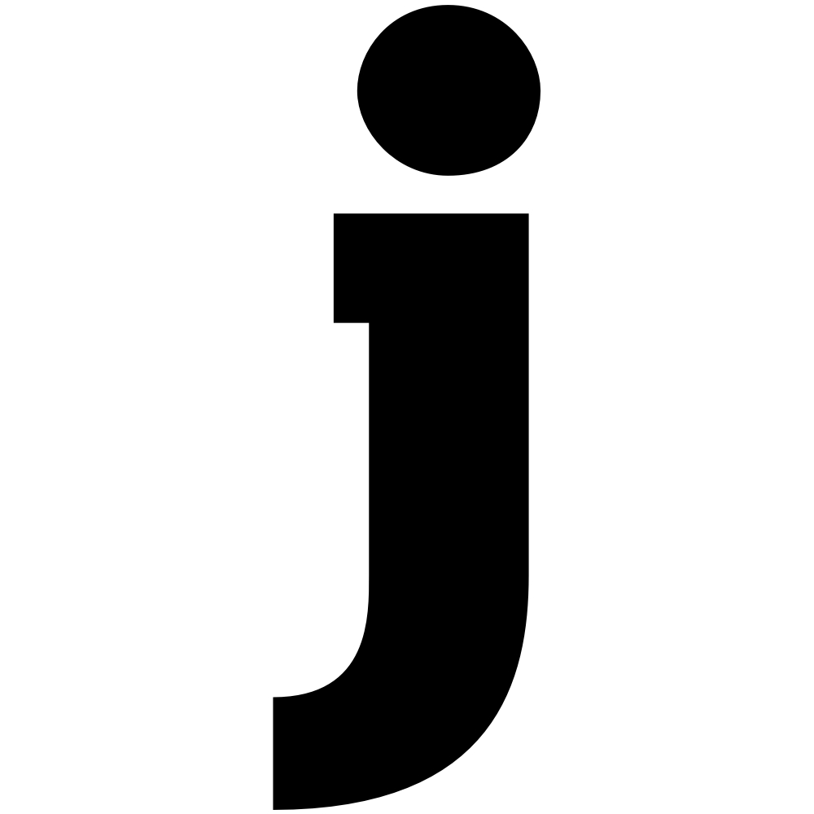

# glyph2jpg
Trivial program to convert font glyphs to jpg images. Uses freetype and libjpeg

I created this because I needed it, sharing in the offchance anyone else does.

once compiled the program is executed as follows:

./glyph2jpg path_to_font image_width image_height xpad ypad depth glyphcode glyph_size output.jpg

where

- path_to_font is a path to a .ttf or other font file supported by freetype
- image_width is the desired width of the generated image in pixels
- image_height is the desired height of the generated image in pixels
- xpad horizonal padding in pixels
- ypad vertical padding in pixels
- depth colordepth of the image, 1 for grayscale, 3 for RGB
- glyphcode The unicode integer for the glyph in decimal
- glyph_size The size of the glyph in the image in 1/64th at 300dpi
- output.jpg The output file

If you choose a glyph_size that means the glyph is scaled to be bigger than the target image size plus padding, then an error will be generated and the program will return 1.

Example:

./glyph2jpg Chunkfive.otf 990 990 5 5 1 106 248 output.jpg

yields:

Note that the glyph is centered in the rendered jpg, and bottom justified (after padding). The width could be reduced in this case to make a smaller image, but in this case the image is square having total dimensions 1000x1000.

When rendering an entire set of glyphs for a font, a run through of all glyphs is needed to get the correct scaling for a given image size. So that they all fit.

test.sh generates ascii a..Z in an output directory called output and can be used for the purpose of determining this
